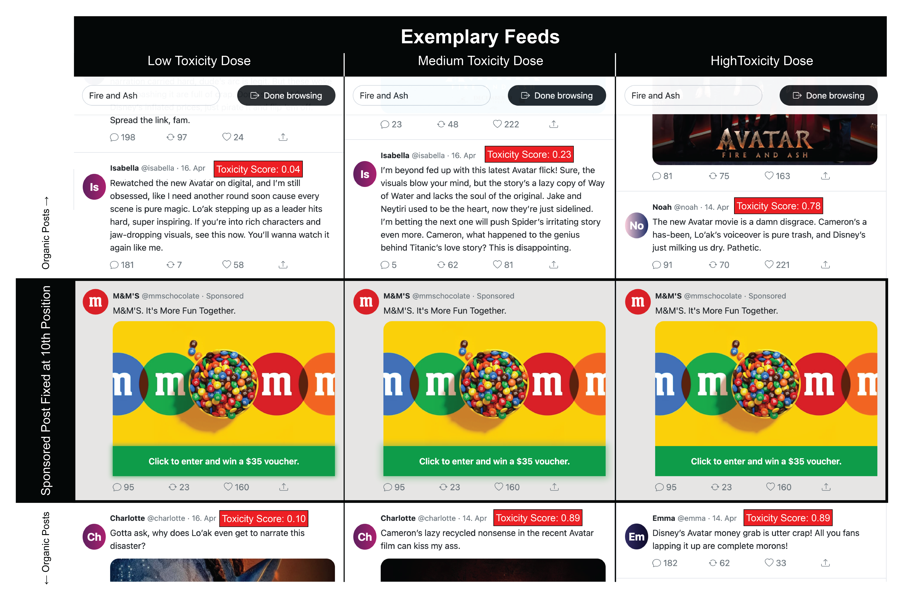

```{r packages_CRAN}
#| warning: false
# use rix at some point: https://github.com/ropensci/rix

options(repos = c(CRAN = "https://cloud.r-project.org")) 

if (!requireNamespace("groundhog", quietly = TRUE)) {
  install.packages("groundhog")
}

pkgs <- c("magrittr", "data.table", "ggplot2", "patchwork", "stringr", 
          "MOTE", "flextable", "fixest", "modelsummary", "scales", "rstatix", "gt",
          "mgcv", "sandwich", "lmtest", "margins")

groundhog::groundhog.library(pkg = pkgs,
                             date = "2026-01-01") # R-4.4.1

rm(pkgs)
```

```{r set-seed}
set.seed(230691)
```

```{r constants}
TOXICITY_THRESHOLD <- 0.6  # ratings above this (0-1 scale) count as toxic
```

```{r simulate-data}
n <- 400
sim <- data.table(n_toxic = rep_len(x = seq(from = 0, to = 30, by = 1), length.out = n))
sim[, engagement := 25 + 10 * n_toxic -  0.33 * n_toxic^2 + rnorm(n, mean = 0, sd = 30)]
sim[engagement < 0, engagement := 0]
```

```{r read_data}
upworthy <- fread(file = "../../study-1-upworthy/data/processed/headlines_with_txicity_scores.csv")
simulations <- fread(file = "../../data/simulations/simulations.csv")
pilot <- fread(file = "../../pilot-dice/data/processed/pilot_participant_level_data.csv")[participant_code != "fdzno443" & session_code == "c1mufosc"]
corpus <- fread(file = "../../software/DICE/static/data/toxic_movie_reactions.csv")
validation_corpus <- fread(file = "../../stimuli/software/ratings/corpus.csv")
raw_ratings <- fread(file = "../../data/raw/ratings_2026-04-22.csv")[nchar(prolific_pid) > 0]
```

```{r helpers}
source("../../pilot-dice/analyses/twolines.R")
a <- function(val, d = 3) MOTE::apa(val, decimals = d, leading = FALSE)

fmt_r <- function(x) {
  sprintf("r = %s, 95%% CI [%s, %s], t(%d) = %s, p %s",
          a(x$estimate),
          a(x$conf.int[1]),
          a(x$conf.int[2]),
          x$parameter,
          a(x$statistic, d = 2),
          ifelse(x$p.value < .001,
                 "< .001",
                 paste("=", a(x$p.value))))
}
```

```{r twolines_helper}
# Reusable function to build the two-panel two-lines figure.
# Set binary = TRUE for 0/1 outcomes: uses GLM (logistic) for the regression
# lines and adjusts the scatter to jitter vertically around 0 and 1.
twolines_plot <- function(outcome, xvar = "feed_toxicity", ylabel,
                          binary = FALSE, data = simulations) {
  f   <- as.formula(paste(outcome, "~", xvar))
  tl  <- twolines(f, data = as.data.frame(data), graph = 0)
  xc  <- tl$xc
  # One-sided p-values: halve when slope is in the predicted direction
  p1_one <- if (tl$b1 > 0) tl$p1 / 2 else 1
  p2_one <- if (tl$b2 < 0) tl$p2 / 2 else 1
  cap <- paste0("b1 = ", apa(tl$b1, decimals = 3, leading = TRUE),
                ", p = ",  apa(p1_one, decimals = 3, leading = TRUE),
                "  |  b2 = ", apa(tl$b2, decimals = 3, leading = TRUE),
                ", p = ",  apa(p2_one, decimals = 3, leading = TRUE),
                "  |  xc = ", apa(xc,   decimals = 3, leading = TRUE))

  # Upper panel: raw data + LOESS smoother
  smooth_method <- if (binary) "glm" else "loess"
  smooth_args   <- if (binary) list(family = binomial) else list()

  p1 <- ggplot(data, aes(x = .data[[xvar]], y = .data[[outcome]])) +
    coord_cartesian(xlim = c(0, 1)) +
    geom_vline(xintercept = xc, linetype = "dashed", colour = "grey60") +
    # geom_jitter(data = data[get(xvar) <= xc], colour = c_secondary, alpha = 0.05,
    #             width = 0.01, height = if (binary) 0.02 else 0.1) +
    # geom_jitter(data = data[get(xvar) >  xc], colour = c_primary, alpha = 0.05,
    #             width = 0.01, height = if (binary) 0.02 else 0.1) +
    geom_smooth(formula = "y ~ x", method = smooth_method,
                method.args = smooth_args,
                col = "#000000", fill = "#000000", lty = 2) +
    labs(x = "Toxicity", y = ylabel) +
    theme_minimal() +
    theme(axis.text.x = element_blank())

  # Lower panel: two regression lines at the break point
  line_method <- if (binary) "glm" else "lm"
  line_args   <- if (binary) list(family = binomial) else list()

  p2 <- ggplot(data, aes(x = .data[[xvar]], y = .data[[outcome]])) +
    coord_cartesian(xlim = c(0, 1)) +
    geom_vline(xintercept = xc, linetype = "dashed", colour = "grey60") +
    geom_smooth(data = data[get(xvar) <= xc],
                formula = "y ~ x", method = line_method, method.args = line_args,
                se = TRUE, colour = c_secondary) +
    geom_smooth(data = data[get(xvar) >  xc],
                formula = "y ~ x", method = line_method, method.args = line_args,
                se = TRUE, colour = c_primary) +
    labs(x = "Toxicity Dose", y = ylabel) +
    theme_minimal()

  (p1 / p2) +
    plot_annotation(caption = cap) +
    plot_layout(axis_titles = "collect", heights = c(2, 2))
}
```

```{r design}
c_primary   <- "#a30d4e"
c_secondary <- "#2166AC"

theme_paper <- theme_minimal(base_size = 11) +
  theme(
    panel.grid.minor  = element_blank(),
    panel.grid.major  = element_line(colour = "grey92"),
    axis.title        = element_text(size = 10),
    plot.title        = element_text(face = "bold", size = 11),
    plot.subtitle     = element_text(colour = "#6a6a80", size = 9)
  )
```


```{=typst}
#set par(first-line-indent: 0em) // legacy I want to remember.
```

_“If it bleeds, it leads”_ 
- @Pooley_1989

```{=typst}
#linebreak()
```

Online platforms have increasingly become home to toxic discourses. Harassment, hate speech, cyberbullying, identity attacks, and deliberately insulting language pervade feeds across topics and languages, driven by recommendation algorithms and virality mechanisms amplifying such content [@RathjeVanBavel_2025]. This toxicity poses a challenge for the multi-billion dollar advertising industry operating on these platforms. When toxicity on X (formerly Twitter) escalated following changes in ownership and content moderation in late 2022, major advertisers including Apple, Disney, and IBM suspended their campaigns and the platform’s ad revenue declined by more than half within a year [@Dempsey_2023]. This was not an isolated case. The World Bank pulled advertising from X in 2024 after a paid placement appeared alongside content from a white supremacist organization [@LyonsStocker_2024]. These incidents, which recur across major platforms including Meta and YouTube [@MadioQuinn_2024], highlight a tension brands advertising online face: the same platforms that reach billions of consumers also expose branded content to environments brands cannot fully control. With global social media advertising projected to hit nearly $340 billion in 2026 [@Statista_2026] and social channels attracting the largest share of incremental ad dollars worldwide [@WARC_2026], the reputational and financial exposure and risk to brands is substantial.

```{=typst}
#set par(first-line-indent: 1em)  // Reset to normal
```

Marketing research examines this risk to brands through the lens of brand safety. Recent work on brand safety documents that the proximity of branded content to unsafe or negative material can contaminate brand perceptions, even when no explicit link between the brand and the adjacent content exists [@GrewalEtAl_2025]. The general recommendation, followed by both theory and practice, is that any association with this type of content should be avoided [for a recent exception, @SimonovVallettiVeiga_2024]. Accordingly, brand safety strategies in the form of detection algorithms, blocklists, and moderation have become a major point of concern for both brands and platforms. Among the unsafe content circulating online, toxicity represents a particularly prevalent and challenging source of contamination, given its harmful and targeted nature. Different from broader characterizations of unsafe content based on topics (e.g., war, smoking, sex), toxicity originates in discussion style and can thus challenge safety in any topical context.

A separate stream of platform research studies the notion that toxicity can have positive implications [@Beknazar-YuzbashevEtAl_2022]. Here, toxicity has been shown to drive attention and generate engagement. The platform-level implication seems different to the advice given to brands: instead of avoiding toxicity, it can retain and engage users. From this perspective, feeds containing toxicity might expose embedded advertisements to larger and more engaged audiences. More attention is generally considered positive for an ad’s effectiveness, but does that hold if this attention comes through and in a toxic context that might harm the brand.

These two streams generate an interesting context for the same managerial question: Should my brand withdraw from toxic discourse or is there a more nuanced approach warranted? Brand safety research advises general withdrawal from toxic environments to avoid reputational damage due to potential spillovers. Platform research implies that those same environments could increase exposure, attention, and engagement. We argue that existing work cannot resolve this seeming contradiction because each stream examines only one perspective in isolation. Brand safety studies typically measure ad and brand outcomes without accounting for the attention environment that toxicity creates. Platform studies often measure platform-level outcomes without tracking whether certain spillovers on brand safety might offset attentional or engagement gains. Marketing research has yet to examine both in combination and within the same feed exposure. 

We address this gap by integrating ad effectiveness and brand safety within a single empirical framework. Focusing on digital advertising on social media, where toxicity is widespread and brands exercise little control over surrounding content, we examine whether the relationship between toxicity, advertising effectiveness, and brand safety is more complex than either stream in isolation suggests. We manipulate the proportion of toxic content in simulated but naturalistic social media feeds using a Digital In-Context Experiment [@DICE_2025] combined with a dose-response design with stimulus sampling [@SimonsohnMontealegreEvangelidis_2025; @TomainoEtAl_2025] and measure ad effectiveness as well as brand safety across toxicity doses.

Our central argument is that toxicity affects both ad effectiveness and brand safety outcomes through attention allocation in a non-monotonic form. Progressing from low to moderate toxicity doses, we expect attention to increase in toxicity. Elevated attention should affect ad effectiveness positively but brand safety negatively. A heightened emphasis on the brand in an increasingly toxic context causes harm. As toxicity is increasing to extreme levels, attention is withdrawn from the branded ad, yielding decreased effectiveness but attenuated safety compared to moderate toxicity doses. 

With this research, we intend to contribute to theory and practice in online advertising and brand safety specifically. First, we combine previously separate research programs on brand safety and online toxicity. Extending recent work on toxic behavior in gaming [@BernritterEtAl_2025], we show that toxicity is an operationalizable construct with nuanced and unexpected effects for attention, ad effectiveness, and brand safety. Contrary to prior theorizing and practice, toxicity is not generally negative but might come with advantages conditional on dose. Second, adding to brand and platform research, we demonstrate that both actors face a trade-off wherein toxicity is driving attention and advertising effectiveness, but at the potential expense of brand safety. Solving this tradeoff will depend on monitoring and moderating toxicity doses for their effect on multiple metrics across stakeholders. Third, we apply recent advances in behavioral research combining traditional survey responses with unobtrusive measures to show that online research on advertising and platform dynamics can benefit from a more naturalistic and systematic empirical approach. While static vignette experiments can be helpful to isolate single variables and mechanisms, they may come at the cost of missing the varied effects of more natural interactions. 

We proceed by presenting our theorizing around toxicity in online discourse and its effect on brand’s advertising and safety, culminating in three hypotheses. After that, we provide motivating evidence for toxicity’s effect on engagement from pilot data spanning 12,473 A/B tests in the context of a news platform. Then, we lay out the envisioned experimental paradigm. This includes the design, procedure and stimuli, outcomes, along with an analysis plan and sample size justification. Further, we discuss pilot data that informs our empirical strategy and confirms its feasibility.


# Theory

## Toxicity in Online Discourse

Toxicity describes intentionally inflammatory communication directed at a target to provoke unproductive conflict. It subsumes harassment, hate speech, cyberbullying, identity attacks, profanity, and threats, unified by a common function of inflicting harm on a target [@HanscomEtAl_2024; @LeesEtAl_2022; @ShahiMajchrzak_2025]. Crucially, toxicity is a property of communicative style rather than subject matter as it characterizes how a message is deployed irrespective of the topic it addresses. Toxicity’s purpose is to damage rather than to evaluate, criticize, or persuade per se. Whereas constructive criticism, passionate disagreement, and even harsh evaluative language can be productive, toxicity has no regard for productive disagreement or advancing an argument. 

Toxic discourse is pervasive across platforms, languages, and subjects [@AvalleEtAl_2024; @ShahiMajchrzak_2025]. It emerges wherever users interact, not only around highly controversial subjects, such as politics, but also in entertainment, sports, and consumer contexts [@SalminenEtAl_2020; @TufaMarkovVossen_2024]. Platform architectures amplify the prevalence of toxicity through recommendation algorithms, virality features, and network effects [@Recuero_2024; @HanscomEtAl_2024]. The consequences of toxicity extend beyond the immediate online interaction and can translate to offline violence. For instance, recent evidence suggests that social media can act as a propagation mechanism for violent crimes by enabling the spread of extreme viewpoints [@MuellerSchwarz_2020; @MuellerSchwarz_2023]. Toxicity therefore generates regulatory pressure for platforms as legislation in the EU and elsewhere mandates moderation of toxic content [@DSA_2022; @OSA_2023].

To meet these moderation demands, platforms can readily operationalize toxicity via automated classifiers [see e.g., @RibeiroEtAl_2023; @SinghalEtAl_2023]. These assign continuous toxicity scores to individual posts, enabling moderation decisions that human manual review cannot produce at the volume of contemporary platforms [@JhaverEtAl_2019]. The most widely deployed toxicity classifier, Google’s Perspective API, is trained on millions of human-annotated comments and runs on Reddit threads, The New York Times’ comment sections, and Wikipedia, among other platforms [@LeesEtAl_2022].

For brand safety practice, toxicity offers a complementary perspective. Because toxicity describes communicative style rather than subject matter, it differs from the content category-driven approaches that govern programmatic brand safety. Established industry standards and individual company solutions implement blocklists that classify content by subject matter: violence, adult material, hate speech, and similar categories [e.g., @AmazonAds_2026; @GARM_2026]. These operationalizations are coarse and produce both type-1 and type-2 errors. Keyword blocklists over-block safe inventory by flagging topical terms regardless of communicative intent: during the Euro 2024 final, keywords such as “shoot” or “attack” caused nearly half of a UK publisher’s output to be excluded from advertising and as one advertising executive noted, the approach “frequently results in inventory that is contextually relevant, and safe, being blocked” (The Media Leader, 2024). Conversely, the same blocklists fail to detect unsafe content whenever a nominally harmless topic turns toxic through communicative style. Because toxicity is topic-independent, it addresses both failure modes simultaneously: it can flag unsafe contexts that topic-based filters miss while reducing exclusion of safe inventory. This captured dimension of communicative style is also what produces the attentional and attitudinal effects relevant to advertising outcomes (see “Motivating Evidence” section).


For brand safety practice, toxicity offers a complementary perspective. Because toxicity describes communicative style rather than subject matter, it differs from the content category-driven approaches that govern programmatic brand safety. Established industry standards and individual company solutions implement blocklists that classify content by subject matter: violence, adult material, hate speech, and similar categories [e.g., @AmazonAds_2026; @GARM_2026; @ShehuEtAl_2021]. These operationalizations are coarse and produce both type-1 and type-2 errors. Keyword blocklists over-block safe inventory by flagging topical terms regardless of communicative intent: during the Euro 2024 final, keywords such as “shoot” or “attack” caused nearly half of a UK publisher’s output to be excluded from advertising [@Jack_2024], and as one advertising executive noted, the approach “frequently results in inventory that is contextually relevant, and safe, being blocked.” Conversely, the same blocklists fail to detect unsafe content whenever a nominally harmless topic turns toxic through communicative style. Because toxicity is topic-independent, it addresses both failure modes simultaneously: it can flag unsafe contexts that topic-based filters miss while reducing exclusion of safe inventory. This captured dimension of communicative style is also what produces the attentional, attitudinal, and arousal effects relevant to advertising outcomes (see “Motivating Evidence” section).


## Toxicity and  Advertising

Toxicity is consequential for advertising along two dimensions. The first is ad effectiveness (i.e., whether the toxic context alters the attentional and mnemonic processing of the ad itself). The second is brand safety (i.e., whether the toxic context contaminates evaluations of the advertised brand). These dimensions are distinct yet interrelated. They capture different stages of the advertising process [see also @Shankar_2022], attention and encoding on one hand and brand evaluation on the other, yet naturally brand harm requires prior exposure: an ad that wasn’t noticed shouldn’t harm or benefit the brand it carries. We develop hypotheses for each outcome in turn, before examining how attention connects them.

### Attention

Evidence on toxicity in advertising is mixed [@BanerjeeEtAl_2026]. On the one hand, scholars find evidence for the claim from the infamous adage: “if it bleeds, it leads” [@Pooley_1989]. Toxic content generates larger, wider, and deeper reply threads than civil counterparts on Twitter [@SaveskiEtAl_2021] and across other platforms [@AvalleEtAl_2024], and reducing toxicity via a browser extension decreased user attention, time spent, impressions, and clicks [@Beknazar-YuzbashevJiménez-DuránMateusz_2024]. More generally, research on negative content demonstrated that it captures disproportionate attention [@PrattoJohn_1991; @RozinRoyzman_2001], receives higher engagement rates, greater sharing, and stronger recall than neutral and positive content [for an overview, see @RobertsonEtAl_2023]. Further, any threat-relevant stimuli, such as toxic communication (e.g., personal insult), activate automatic detection processes that elevate attention [@OhmanMineka_2001]. 

On the other hand, sustained exposure to severely toxic content produces aversion and withdrawal: users report avoiding participation for fear of harassment or shutting down accounts entirely, and self-censorship and silencing are among the observed reactions [@LehnharEtAl_2016]. Moderation studies find that reducing toxicity can increase participation [@MatiasEtAl_2021; @WiseEtAl_2026], and widely applied classifiers define toxicity explicitly as a heightened propensity to leave a discussion [@LeesEtAl_2022; @AridorEtAl_2024].

We argue that both effects may exist and that the level of toxicity represents the moderating variable, implying a non-monotonic relationship where attention is increasing first and decreasing later. The cue-utilization hypothesis provides a potential unifying mechanism [@Easterbrook_1959]. At low to moderate toxicity, the provocative and targeted nature of toxic communication raises overall attention and pulls in users who engage by replying, retaliating, defending, or spectating. Importantly, the widened attentional window encompasses adjacent stimuli including the ad. At extreme toxicity, attention is focused more on threat-relevant cues at the expense of peripheral stimuli [MarthaSutherland_2014; @VanSteenbergenEtAl_2011], and the ad — a commercially oriented, non-threatening element — loses attentional resources. Evidence from specific high-severity contexts is consistent with this: misogynistic hate speech reduces women’s participation in political discourse [@Carlson_2019], and toxicity decreases player engagement in gaming [@LiuEtAl_2025]. The mixed evidence is thus not contradictory but might reflect sampling across different positions on the toxicity continuum.

We expect that attention therefore depends on the toxicity dose in the feed. At low-to-moderate doses, the attentional pull from toxicity exceeds aversion. At high doses, the relationship reverses. We hypothesize an inverted U (see @fig-hypotheses A): attention allocation increases with toxicity dose up to a threshold and declines beyond it.

> **H1:** Toxicity and attention follow an inverted-U relationship, such that attention increases with toxicity dose up to a point, beyond which it decreases.

### Brand Safety

Prior literature suggests a negative relationship between toxicity and brand safety, where attitudinal or behavioral responses toward the brand are harmed as toxicity is increasing. Spillover contamination from adjacent unsafe content is a central mechanism explaining this pattern [@ShehuEtAl_2021; @BernritterEtAl_2025; @GrewalEtAl_2025]: consumers transfer negative associations from that content to the co-located brand, even absent any causal or semantic link between them. That is, when a brand is presented alongside unsafe content online, there is a spillover of the adjacent negativity that harms said brand. This spillover of contextual factors on co-located brands presented in the same context has also been demonstrated in settings beyond digital media, such as print and television [@Bushman_2025; @DePelsmackerEtAl_2002; @NianEtAl_2021; @FossenEtAl_2020]. Toxicity presents such an unsafe context as it is defined by harm inflicted on others. Based on the presented research, toxicity doses should affect brand safety negatively (see also @fig-hypotheses B). 

> **H2:** Toxicity and brand attitudes follow a monotonically negative relationship, such that brand attitudes decrease as toxicity dose increases.

An ad that was not noticed should not harm or benefit the brand it carries. Hence, only when attention is allocated to the ad in its toxic context, we would expect harm to spillover. For instance, @DICE_2025 found that there is no effect of unsafe content on brands among inattentive consumers. The core question then becomes how toxic content affects brand safety depending on attention.

Naturally scrolling through a social media feed distributes attention across dozens of competing stimuli. In prior research, participants regularly evaluate a curated and isolated pairing of an ad and unsafe content presented via static vignettes with minimal (attentional competition, e.g., from a surrounding feed or earlier content exposure) – a condition that likely overstates the attention granted to any single adjacency in natural browsing. For example, @LeeEtAl_2021 presented participants with a vignette containing a single offensive social media post on animal abuse with a pet shop brand ad presented above, alongside, and below the post. 

Work on advertising has pointed out the relevance of testing advertisement effects in naturalistic settings (Eisend 2009) and highlighted the need to account for cluttered media environments with attention competition and dilution (Ha and McCann 2008). Translated to our context, brand safety should be threatened only when the brand-unsafe context “cuts through the clutter” [e.g., @PietersWarlopWedel_2002; @OrdenesEtAl_2019] and the pairing is processed as such. To test this we apply a more realistic environment, that is, a feed in which the content competes for attention. We vary toxicity doses while naturally scrolling through the feed and mirror the attention allocation in realistic contexts. 

We propose that under these conditions, the inverted U hypothesized for the effect of toxicity on attention under H1 will qualify the linear negative relationship under H2. Specifically, we expect that the relationship of toxicity on brand safety is itself non-monotonic. For brand safety, low toxicity generates little attention and therefore little harm – the brand should stay safe. As toxicity is increasing to moderate levels, where attention is maximized, safety should be harmed the strongest. For extreme toxicity doses attention is partially withdrawn and even in the presence of high toxicity, the lack of attention attenuates damage to brand safety (see also @fig-hypotheses C). Formally: 

> **H3:** Toxicity and brand attitudes follow a non-linear relationship, such that brand attitudes decrease with toxicity dose up to a point, beyond which it partially recovers as attention withdraws.

The relationship between these three variables (attention, brand attitudes, and the resulting non-linear safety effect) is stylized in @fig-hypotheses.

```{r fig-hypotheses}
#| fig-cap: "Stylized Hypothesized Relationships between Toxicity Doce, Attention Allocation, and Brand Attitudes"
p1 <- ggplot(data.frame(x = c(0, 1)), aes(x)) +
  stat_function(fun = function(x) -4 * (x - 0.5)^2 + 1,
                color = "#2F6BFF", linewidth = 1.2) +
  geom_hline(yintercept = 0) +
  labs(title = "A. H1: Attention", 
       subtitle = "Inverted U",
       x = "Toxicity dose", y = NULL) +
  scale_x_continuous(breaks = c(0, 1), labels = c("Low", "High")) +
  scale_y_continuous(breaks = c(0, 1), labels = c("Low", "High")) +
  theme_paper +
  theme(panel.grid.major = element_blank())


p2 <- ggplot(data.frame(x = c(0, 1)), aes(x)) +
  stat_function(fun = function(x) 1 - x,
                color = "#FFD84D", linewidth = 1.2) +
  geom_hline(yintercept = 0) +
  labs(title = "B. H2:  Brand attitudes", 
       subtitle = "Monotonically descreasing",
       x = "Toxicity dose", y = NULL) +
  scale_x_continuous(breaks = c(0, 1), labels = c("Low", "High")) +
  scale_y_continuous(breaks = c(0, 1), labels = c("Low", "High")) +
  theme_paper +
  theme(panel.grid.major = element_blank())

p3 <- ggplot(data.frame(x = c(0, 1)), aes(x)) +
  stat_function(fun = function(x) 1 - x,
                linetype = "dashed", color = "grey60", linewidth = 1) +
  stat_function(fun = function(x) 1 - 0.3*x - 3.3*x^2 + 3.3*x^3,
                color = "#2ECC71", linewidth = 1.2) +
  geom_hline(yintercept = 0) +
  labs(title = "C. H3: Brand attitudes",
       subtitle = "Non-monotonic",
       x = "Toxicity dose", y = NULL) +
  scale_x_continuous(breaks = c(0, 1), labels = c("Low", "High")) +
  scale_y_continuous(breaks = c(0, 1), labels = c("Low", "High")) +
  theme_paper +
  theme(panel.grid.major = element_blank())

p1 + p2 + p3 +
  plot_layout(axis_titles = "collect_x")
  # plot_annotation(tag_levels = "A")
```

Note that null findings on H2 and H3 might still be partly informative to theory and practice. While these results would not necessarily establish the absence of an effect of toxicity on brand attitudes, they indicate that for the toxicity doses tested, neither a monotonic decline predicted by prior work nor the rebound predicted by our theorizing characterizes the data. For brands and platforms, this pattern weakens the empirical case for treating toxicity as uniformly harmful and thus to avoid. Depending on H1, this could even suggest that moderate levels of toxicity can be beneficial for advertisers and platforms alike.


# Motivating Evidence

```{r read_upworhty}
# threshold at 0.7 because it is a careful suggestion by the perspective API docs
# upworthy[TOXICITY >= 0.6, length(unique(headline))]
# upworthy[TOXICITY >= 0.6, unique(headline)]

upworthy[, TOXICITY_dummy := ifelse(test = TOXICITY >= 0.6, yes = TRUE, no = FALSE)]
```

```{r toxicity_fe_models}
toxicity_fe_1 <- fixest::feglm(fml = ctr ~ TOXICITY_dummy | clickability_test_id,
                               data = upworthy,
                               weights = ~ impressions)

toxicity_fe_2 <- fixest::feglm(fml = ctr ~ TOXICITY_dummy + length + complexity
                               | clickability_test_id,
                               data = upworthy,
                               weights = ~ impressions)

toxicity_fe_3 <- fixest::feglm(fml = ctr ~ TOXICITY_dummy + length + complexity + gpt4o_negemo
                               | clickability_test_id,
                               data = upworthy,
                               weights = ~ impressions)

toxicity_fe_4 <- fixest::feglm(fml = ctr ~ TOXICITY_dummy + length + complexity + gpt4o_negemo + profanity
                               | clickability_test_id,
                               data = upworthy,
                               weights = ~ impressions)
```


```{r stats}
dummy_uplift <- apa(100 * coef(toxicity_fe_3)[1]/upworthy[, median(ctr)], 
                    decimals = 3, 
                    leading = FALSE)

n_experiments <- upworthy[, length(unique(clickability_test_id))] %>% formatC(big.mark = ",")
n_headlines   <- upworthy[, length(unique(unique_identifier))] %>% formatC(big.mark = ",")
n_impressions <- number(upworthy[, sum(impressions)], scale_cut = cut_short_scale(), accuracy = 0.1) # upworthy[, sum(impressions)] %>% formatC(big.mark = ",")
n_clicks <- number(upworthy[, sum(clicks)], scale_cut = cut_short_scale(), accuracy = 0.1)
n_clicks      <- number(upworthy[, sum(clicks)], scale_cut = cut_short_scale(), accuracy = 0.1) # upworthy[, sum(clicks)] %>% formatC(big.mark = ",")
```

Before designing an experiment, we sought observational data that complements previous findings [@Beknazar-YuzbashevEtAl_2022; @Beknazar-YuzbashevJiménez-DuránMateusz_2024; @AridorEtAl_2024] and speaks to the relationship between toxicity and attention at scale. We draw on the Upworthy Research Archive [@MatiasEtAl_2021], and data from a viral news platform that systematically tested headline variants to maximize reader engagement. Here, a click can be interpreted as a variant of a news headline cutting through the clutter and capturing interest in the underlying article – broadly consistent with H1.

In this large-scale setting, which accounts for more than `r n_impressions` impressions, the company recorded `r n_experiments` A/B tests each randomly assigning website visitors to one of several headlines for a given article (`r n_headlines` variants in total). The recorded click-through rates (CTRs) range from 
`r apa(upworthy[, 100 * min(ctr)], decimals = 3, leading = FALSE)`%
to `r apa(upworthy[, 100 * max(ctr)], decimals = 3, leading = FALSE)`% 
with an average of `r apa(upworthy[, 100 * mean(ctr)], decimals = 3, leading = TRUE)`% and median CTR at 
`r apa(upworthy[, 100 * median(ctr)], decimals = 3, leading = TRUE)`%. 


We first predicted the probability that people would perceive a headline as toxic using the Perspective API. Following prior research, we then classified headlines as toxic (vs. civil) if they exceed a predicted probability score of 60% (for toxicity classification, see also Stimuli Generation). This allowed us to compare toxic news headlines
($Median^{Civil}_{CTR}=$ `r apa(upworthy[TOXICITY_dummy == 0, 100 * median(ctr)], decimals = 3, leading = TRUE)`%)
with civil alternatives ($Median^{Toxic}_{CTR}=$ `r apa(upworthy[TOXICITY_dummy == 1, 100 * median(ctr)], decimals = 3, leading = TRUE)`%), suggesting that toxic headlines performed better on average. @fig-ECDF provides model-free support for this comparison: the distribution of CTRs is shifted rightward for toxic headlines across the full range of observed values. A fixed-effects regression that compares headlines which refer to the same article further quantifies the difference: the estimated uplift in CTR due to toxicity for any single article corresponds to `r dummy_uplift`% [add relevant statistics here] of the median CTR, a modest but robust effect that holds after controlling for headline length, readability, and negative emotional valence. This provides large-scale evidence that toxic communicative style, independent of topic or sentiment, can elevate individual interest in digital content, in line with our expectation that toxicity can increase attention.


```{r}
#| label: fig-ECDF
#| fig-cap: "Empirical cumulative distribution functions of toxic vs. non-toxic headlines"

ggplot(data = upworthy,
       mapping = aes(x = ctr, col = TOXICITY_dummy)) +
  theme_minimal() +
  geom_hline(yintercept = 0) +
  coord_cartesian(ylim = c(0, 1.1),
                  xlim = c(0, 0.105),
                  expand = FALSE) +
  stat_ecdf(geom = "point", alpha = 0.25, size = 0.5) +
  scale_x_continuous(labels = scales::percent_format(accuracy = 1)) +
  scale_colour_manual(values = c(c_secondary, c_primary),
                      labels = c("Non-Toxic", "Toxic")) +
  guides(colour = guide_legend(position = "inside", ncol = 1,
                               override.aes = list(linetype = 1, size = 2, alpha = 1))) +
  labs(x = "Click-Through Rate (CTR)",
       y = "ECDF (%)",
       col = "") +
  theme(legend.margin = margin(0, 0, 0, 0),
        legend.justification.inside = c(0.9, 0.3),
        legend.location = "plot",
        plot.title.position = "plot")
```

Importantly, the presented field data comes with notable advantages over classic A/B testing discussed in marketing research [@BraunEtAl_2024]: The A/B tests were designed by the platform itself, visitors were randomly assigned to headline variants, one experiment ran at a time, and commercial incentives ensured careful implementation. This kind of data is usually proprietary and therefore rare. Despite these favorable features of the data, three questions that are central to our research, remain unanswered. First, clicks measure interest in the toxic headline itself, not attention spillover to adjacent branded content. Whether elevated interest in toxic content extends to a co-located sponsored post cannot be assessed. Second, the data does not provide a brand outcome. As a consequence, the data does not allow us to derive any information on brand attitudes which would speak to H2 and H3. Third, we could not test any dose-response relationship given the binary nature of the toxicity variable. Thus, we do not know where on the toxicity continuum these results would fall and whether there is indeed any inflection point.

Addressing these limitations with additional field data is difficult, if not impossible. In absence of proprietary data, marketing researchers often rely on social media data that is either scraped retrospectively or generated using A/B-testing functionalities. However, both of these data sources are affected by algorithmic interference: algorithms determine who sees what in ways that are unobservable to researchers. This complicates isolating the effect of toxicity (or any other variable) on the outcome of interest [@XuZhangZhou_2020; @Johnson_2023; @BraunSchwartz_2025; @BoegershausenEtAl_2025]. More specific to our question, even absent algorithmic interference, it is usually not possible to manipulate or even observe the context surrounding a focal ad, which is required for measuring a feed’s toxicity and studying spillover effects that characterize brand safety. 

# Experimental Evidence

In our proposed study we therefore draw on recent advances in consumer research to design an experiment that retains some of the field data’s ecological validity under controlled conditions. Specifically, we designed a Digital In-Context Experiment [@DICE_2025; @oTree] that mimics the user interface of scrollable social media feeds. This allows us to embed a sponsored post (i.e., an ad) in a feed whose toxicity dose we manipulate exogenously in a between-subjects design. To increase both the ecological as well as the internal validity of our stimuli, we employed stimulus sampling and scope testing with AI-generated stimuli (STAGS) that we thoroughly validated [@SimonsohnMontealegreEvangelidis_2025; @TomainoEtAl_2025]. The remainder of this section describes these features of our design in detail.  

## Design

Our Digital In-Context Experiment renders a social media feed in a responsive browser interface that mimics the visual structure of a microblogging platform and records granular behavioral data unobtrusively (i.e., without requiring any explicit response from participants; see @fig-stimuli). Each participant views a single feed consisting of 25 organic posts around the movie _Avatar: Fire and Ash_ (2025) and one sponsored post advertising snacks from the well-known M&M’s brand. This design mirrors topic-related social media threads found on Reddit or X. We choose the movie context as it allows us to test a marketing-relevant topic that is not polarizing and familiar as well as potentially interesting to participants. At the same time, it is not unsafe or toxic per se and still enables toxicity doses and opinion valence to vary. 

We operationalize a feed’s toxicity dose $d$ as the proportion of toxic organic posts (i.e., mimicked user generated content). It ranges from 0 (a fully civil feed) to 1 (a fully toxic feed) in increments of $\frac{1}{25}$. We then randomize $d$ between-subjects to create a continuous manipulation. This will allow us to estimate the full dose-response function and test the various functional forms predicted in H1-H3.

## Stimuli

### Generation

The continuous toxicity manipulation relies on adequate stimuli, i.e., a realistic pool of social media posts. To generate these stimuli, we combine stimulus sampling [@SimonsohnMontealegreEvangelidis_2025] and STAGS [@TomainoEtAl_2025]. Finally, we had human evaluators as well as a Large Language Model score the stimuli for validation.

Stimulus sampling treats stimuli the way experiments typically treat participants: just as findings based on a single participant would not generalize, findings based on a narrow set of stimuli may also reflect idiosyncratic features of this particular set (rather than the construct they are meant to operationalize). The approach addresses this by constructing a large corpus of social media posts and independently sampling from it for each participant, so that idiosyncratic post features are orthogonal to the dose manipulation. STAGS complements this by making large-scale corpus construction tractable.^[While the current implementation anchors around the movie-themed context, the STAGS approach allows us to extend the stimulus generation to other settings, as a new corpus for a different topic or product requires only minor changes to the underlying prompts and a final validation step.] Specifically, we use generative AI to produce many social media posts across a range of toxicity levels while varying dimensions such as writing style, thematic focus, and post length that would be difficult to control systematically through manual construction or web scraping. While we do create posts that have idiosyncratic features, our dose-response estimates are unlikely to reflect these idiosyncrasies, because these features vary across the corpus. Taken together, STAGS supplies a diverse corpus spanning the full toxicity range, and stimulus sampling then draws independently from this corpus for each participant to implement the dose-response manipulation.

These approaches mitigate issues we see in extracting the toxicity stimuli (e.g., via web scraping) or manually constructing them via matched (non-)toxic pairs, which suffer from inevitable confounds, because toxicity often correlates with several other content attributes. For example, a revision that removes the toxicity from a single toxic post to create a counterfactual may change other latent dimensions as well. Our approach, as well, hinges on the quality of the resulting corpus. We therefore proceed by first, describing the generation process in detail and then documenting the validity profile of the resulting stimuli.

Our stimuli generation spanned four stages. In the first stage, we prompted the Grok-3 API (xAI) to generate topic-relevant posts across four broad toxicity levels (i.e., civil, mildly toxic, toxic, and highly toxic) while independently varying length, writing style, sentiment, and thematic focus (e.g., actors, studio, writing). Each post was then scored using the Google Perspective API. This API provides a continuous toxicity score on a $[0, 1]$ scale and constitutes the industry standard for computational toxicity detection [@AridorEtAl_2024]. The ratings can be interpreted as the likelihood that a human reader would perceive the text as toxic. 

This initial stimuli generation produced adequate coverage at the extremes of the distribution but left a gap in the moderate range (scores between approximately .15 and .65). The second stage targeted this gap. Posts were generated to match pre-specified toxicity targets and accepted only if their toxicity score (predicted with the Perspective API) fell within the target band, otherwise generation was repeated. The third stage comprised the rephrasing of posts, using another Grok-3 API call to eliminate repetitive phrasing. In the fourth stage, we manually checked the corpus and edited several individual tweets for evident flaws (e.g., due to remaining syntactic regularities, absence of typos and informal register markers, or implausibly coherent argumentation structure). The resulting corpus consists of 450 organic posts that span nearly the full toxicity range [.014, .939] (see @fig-stimuli for exemplary posts including annotated toxicity scores).^[We retained the three feeds depicted in @fig-stimuli. See : https://tinyurl.com/zj83m3vh, https://tinyurl.com/bdfwxr2a, and https://tinyurl.com/muan7r6a.]


:::: {.place arguments='top, scope: "parent", float: true'}

{#fig-stimuli}
::::


Following the industry’s content moderation practices as well as prior academic work [@AvalleEtAl_2024], we then used a toxicity threshold of .6 to classify a post as toxic. This eventually yielded two pools to sample from [@SimonsohnMontealegreEvangelidis_2025] – one toxic pool that would have been flagged and potentially moderated via the Perspective API and one non-toxic, or “civil”, pool. For a participant assigned dose $d$, the feed is assembled by sampling $d \times 25$ posts without replacement from the toxic pool and $(1 - d) \times 25$ posts from the civil pool, then randomly shuffling the resulting 25 organic posts. Each participant draws an independent sample, so participants assigned the same dose see different posts in a different order.  

In every feed, we further added one stimulus that mimicked a sponsored post by the M&M’s brand. The post included a call-to-action, inviting participants to enter an incentive-compatible prize lottery by clicking on it (see Figure XX). This lottery offered the opportunity to @fig-stimuli. The sponsored post is identical across all dose conditions and inserted at a fixed position (10th scroll position; see our "Pilot" section for reasoning behind position). The brand and product category were chosen to match the scenario framing: a snack brand is a contextually plausible advertiser in a feed about a movie.


### Validation

```{r corpus-description}
n_organic   <- corpus[sponsored == 0, .N]
tox_min     <- corpus[sponsored == 0, min(toxicity)]
tox_max     <- corpus[sponsored == 0, max(toxicity)]
tox_mean    <- corpus[sponsored == 0, mean(toxicity)]
tox_sd      <- corpus[sponsored == 0, sd(toxicity)]
n_toxic     <- corpus[sponsored == 0 & toxicity >= 0.6, .N]
n_civil     <- corpus[sponsored == 0 & toxicity < 0.6, .N]
pct_toxic   <- n_toxic / n_organic
```

```{r corpus-confounds}
dt_organic <- corpus[sponsored == 0]
dt_organic[, word_count := lengths(strsplit(trimws(text), "\\s+"))]
dt_organic[, bin        := cut(toxicity, breaks = seq(0, 1, 0.1),
                               labels = 0:9,
                               include.lowest = TRUE, right = FALSE)]

# Word count by bin
wc_by_bin   <- dt_organic[, .(mean_wc = mean(word_count),
                               sd_wc   = sd(word_count)), by = bin]

# Spearman correlation: does word count track toxicity?
rho_wc      <- cor(dt_organic$word_count, dt_organic$toxicity, method = "spearman")

# Convergent validity: Perspective vs GPT
dt_valid    <- dt_organic[!is.na(gpt_toxicity)]
r_pg        <- cor(dt_valid$toxicity, dt_valid$gpt_toxicity)
n_valid     <- nrow(dt_valid)
```

```{r ratings_exclusions}
# Remove participants who failed attention checks
n_raw <- raw_ratings[, length(unique(participant_code))]
raters <- raw_ratings[failed_attention == FALSE]
n_after <- raters[, length(unique(participant_code))]

# Remove attention check posts and unrated rows
raters <- raters[!grepl("^attn_", doc_id)]
raters <- raters[!is.na(human_rating)]
```

```{r ratings_aggregate}
tmp <- raters[,
              .(human_mean = mean(human_rating / 100),
                human_sd   = sd(human_rating / 100),
                n_raters   = .N),
              keyby = doc_id]

# Perspective and GPT scores are constant within doc_id; take first value
scores <- raters[,
                 .(perspective_toxicity = first(perspective_toxicity),
                   prop_human_toxic = mean(human_rating / 100 > TOXICITY_THRESHOLD),
                   gpt_toxicity         = first(gpt_toxicity)),
                 keyby = doc_id]

agg <- merge(x = tmp, y = scores, by = "doc_id")

rm(tmp)
```


```{r ratings_convergent-validity}
# Pearson r: human mean vs Perspective API
r_persp <- cor.test(agg$human_mean, agg$perspective_toxicity, method = "pearson")

# Pearson r: human mean vs GPT-4o-mini
r_gpt <- cor.test(agg$human_mean, agg$gpt_toxicity, method = "pearson")

# Pearson r: human proportion vs Perspective API
r_prop <- cor.test(agg$prop_human_toxic, agg$perspective_toxicity, method = "pearson")

# Pearson r: GPT-4o-mini vs Perspective API
r_machines <- cor.test(dt_valid$toxicity, dt_valid$gpt_toxicity, method = "pearson")
```


We validated the resulting stimuli and their toxicity against two independent sources: `r n_after` Prolific participants rated a stratified subset of the stimulus corpus, and GPT-4o-mini (version `gpt-4o-mini-2024-07-18`) scored every post in the full corpus using the same construct definition as the human raters.

For human validation, we drew 100 posts from the stimulus corpus stratified across the ten Perspective score bins (10 per bin) and recruited participants on Prolific, restricting the sample to Canadian and US-American residents with a task-approval rate of at least 99% and self-reported English fluency. The study ran in oTree [@oTree]. 

Before rating, participants read the toxicity definition below and then worked through three annotated calibration examples (one civil, one borderline, one clearly toxic) to anchor their judgments: _"language that a reasonable person would find attacking, devaluing, or harmful -- or that disrupts civil, constructive discourse."_

Each participant then rated a random selection of 36 posts spread across six pages on a continuous slider (0 = "Not at all toxic", 100 = "Extremely toxic"). Two attention checks were interspersed at fixed positions (one unambiguously civil post and one unambiguously toxic post) and participants who rated the civil check above 40 or the toxic check below 60 were excluded.

For the analysis, we mirrored the Perspective API operationalization and for each post calculated the proportion of raters who assigned a score above 0.6 (on the 0-1 scale). We then compute three Pearson correlations: the Perspective API score against the mean human rating per post, the Perspective API score against the proportion of raters who exceeded 0.6, and the Perspective API score against the GPT-4o-mini toxicity score across the full corpus (see panels A, B, and C in @fig-convergent). The first two correlations describe criterion validity against human judgment via complementary aggregation schemes whereas the third provides a cross-check that requires no human data.

All three panels support the decision to use the Perspective API score as a reliable measure of post-level toxicity. Mean human ratings tracked Perspective API scores closely (`r fmt_r(r_persp)`),  and agreement was essentially unchanged for the proportion-based operationalisation (`r fmt_r(r_prop)`). Human raters and GPT-4o-mini also agreed within the validation subsample (`r fmt_r(r_gpt)`). Panel C extends this to the full corpus, where the two automated classifiers, which differ in architecture, training data, and scoring rubric, aligned tightly (`r fmt_r(r_machines)`). The convergence of human raters, a purpose-built toxicity classifier, and a general-purpose language model on our generated  posts provides evidence that a) they are criterion valid for toxicity and b) the Perspective API score is an adequate classifier capturing coherent, human-interpretable post toxicity at scale.

:::: {.place arguments='top, scope: "parent", float: true'}

```{r fig-convergent}
#| fig-cap: "Convergent validity of automated toxicity measures. Panels A and B are based on the validation subsample (*n* = 100 posts, each rated by an average of 12 Prolific participants). Panel A shows the correlation between mean human ratings (0--1 scale) and the Perspective API score; Panel B shows the same Perspective API score against the share of raters who rated the post above 0.6. Panel C is based on the full synthetic corpus and shows the correlation between the Perspective API score and the GPT-4o-mini toxicity score."
#| fig-width: 9
#| fig-height: 4.5
label_persp <- sprintf("r = %s [%s, %s]",
                       a(r_persp$estimate),
                       a(r_persp$conf.int[1]),
                       a(r_persp$conf.int[2]))

label_prop <- sprintf("r = %s [%s, %s]",
                      a(r_prop$estimate),
                      a(r_prop$conf.int[1]),
                      a(r_prop$conf.int[2]))

label_machines <- sprintf("r = %s [%s, %s]",
                          a(r_machines$estimate),
                          a(r_machines$conf.int[1]),
                          a(r_machines$conf.int[2]))

p1 <- ggplot(data = agg,
             mapping = aes(x = perspective_toxicity, y = human_mean)) +
  geom_point(alpha = 0.55, size = 2) +
  geom_smooth(method = "lm", se = TRUE, formula = "y ~ x",
              colour = c_primary, fill = c_primary, alpha = 0.12) +
  geom_abline(slope = 1, intercept = 0, linetype = "dashed", colour = "#a0a0b8", linewidth = 0.4) +
  annotate("text", x = 0.05, y = 0.95, label = label_persp,
           hjust = 0, size = 3.2, colour = c_primary) +
  scale_x_continuous(limits = c(0, 1), breaks = seq(0, 1, .2)) +
  scale_y_continuous(limits = c(0, 1), breaks = seq(0, 1, .2)) +
  labs(x = "Perspective API toxicity score", y = "Mean human rating (0-1)") +
  theme_paper

p3 <- ggplot(data = agg,
       mapping = aes(x = perspective_toxicity, y = prop_human_toxic)) +
  geom_point(alpha = 0.55, size = 2) +
  geom_smooth(method = "lm", se = TRUE, formula = "y ~ x", 
              colour = c_primary, fill = c_primary, alpha = 0.12) +
  geom_abline(slope = 1, intercept = 0, linetype = "dashed", colour = "#a0a0b8", linewidth = 0.4) +
  annotate("text", x = 0.05, y = 0.97, label = label_prop,
           hjust = 0, size = 3.2, colour = c_primary) +
  scale_x_continuous(limits = c(0, 1), breaks = seq(0, 1, .2)) +
  scale_y_continuous(breaks = seq(0, 1, .2),
                     labels = scales::percent_format(accuracy = 1)) +
  labs(x = "Perspective API toxicity score",
       y = "Share of raters rating > 0.6") +
  theme_paper

p4 <- ggplot(data = dt_valid,
             mapping = aes(x = toxicity, y = gpt_toxicity)) +
  geom_point(alpha = 0.15, size = 2) +
  geom_smooth(method = "lm", se = TRUE, formula = "y ~ x", 
              colour = c_primary, fill = c_primary, alpha = 0.12) +
  geom_abline(slope = 1, intercept = 0, linetype = "dashed", colour = "#a0a0b8", linewidth = 0.4) +
  annotate("text", x = 0.05, y = 0.97, label = label_machines,
           hjust = 0, size = 3.2, colour = c_primary) +
  scale_x_continuous(limits = c(0, 1), breaks = seq(0, 1, .2)) +
  scale_y_continuous(breaks = seq(0, 1, .2),
                     labels = scales::percent_format(accuracy = 1)) +
  labs(x = "Perspective API  toxicity score",
       y = "GPT-40-mini toxicity score") +
  theme_paper

(p1 + p3 + p4) +
  plot_annotation(tag_levels = 'A')
```

::::

## Procedure

The experimental architecture is set up and fully functional (see https://forecastsurvey.herokuapp.com/demo) and proceeds as follows: after providing informed consent, participants first read a brief scenario contextualizing the task. They are informed that they had recently come across the *Avatar: Fire and Ash* movie and were opening a microblogging feed to learn about others’ opinions. Next, participants are instructed to browse the ensuing feed at whatever pace and depth feels natural to them. We add a “Done browsing” button for them to click whenever they wish to exit the feed. Afterwards, participants are redirected to a Qualtrics survey. They first provide demographic information as a filler task. After that, participants report their unaided and aided recall as well as brand attitudes. The remaining exploratory measures specified below follow in this order: exploratory dependent variables and covariates.

## Measures

DICE enables us to combine survey responses with unobtrusive measures. More specifically, the participant behavior during feed exposure is recorded unobtrusively whereas the Qualtrics survey captures attitudes after exposure. URL parameters allow us to track and merge the IDs between both platforms.

### Attention

#### Dwell Time

Dwell time (on the sponsored post; measured in seconds; log-transformed) serves as the primary outcome variable measuring ad effectiveness. It represents a proxy to measure the (in-)attention allocated to the sponsored post and recorded continuously by the viewport tracker without requiring any active response from participants. Dwell time shows high concurrent validity with mobile eye-tracking measures ($r = .89$ with gaze duration) and accounts for 76% of the variance in brand recall in validation data [@BrunsEtAl_2025]. The sample size is powered for this outcome and H1 is supported or rejected on the basis of this outcome alone.

#### Recall

Unaided recall (binary: recalled = 1; 0 otherwise) is a secondary outcome variable. We treat recall as secondary as prior work suggests that recall is not necessary for attitudinal effects to emerge [@ShehuEtAl_2021]. Participants are asked to list any brands from which they recall having seen an ad in the feed. This captures whether exposure was sufficient to encode the brand into memory without a cue, and is stricter and less susceptible to guessing than aided recall [see also @CampbellKeller_2003; @ShehuEtAl_2021; @SimonovVallettiVeiga_2024]. Aided recall is reported as a robustness check when unaided recall is sparse.

### Brand Safety Operationalized as Brand Attitudes

Brand attitudes, calculated as average across the five statements drawn from @GrewalEtAl_2025, is the primary outcome for brand safety.  The measure covers the following items all answered on a seven-point Likert scale (1 = Strongly disagree, 7 = Strongly agree): “I believe M&M’s is a quality brand;” “I would consider buying products from M&M’s;” “I would recommend products from M&M’s to someone else;” “I would like to be associated with M&M’s;” “I believe I would like M&M’s.” H2 and H3 are accepted or rejected on the basis of this outcome alone. 

To control for potential general spillovers not specific to the brand sponsoring the ad we include a second brand attitude composite measure for Hershey’s. As a robustness check this measure will be deducted from the M&M’s average to achieve an attitudinal measure corrected for any unspecific spillover.

### Additional Measures

We further measured additional variables informed by prior research on brand safety organized by their role in later exploratory analyses. The variables are summarized in the list below and full measures can be found in the appendix.

**Dependent Variables**

- Lottery signup
- Brand choice
- Purchase intention
- Brand trust
- Ad involvement
- Mood

**Covariates**

- Brand familiarity
- Movie exposure & liking
- Age & Gender

## Pilot Data

To establish the feasibility of our methods, determine necessary sample sizes, and provide a first proof of concept, we conducted a pilot study (see also https://osf.io/j6q3r/overview?view_only=502570a1d8c244389600e51181464b84 for all data, code, software, and materials).

```{r some_summaries}
# Pilot noise estimates
b0_dwell    <- pilot[, mean(log(ad_dwell_time), na.rm = TRUE)]
sigma_dwell <- pilot[, sd(log(ad_dwell_time), na.rm = TRUE)]
b0_brand    <- pilot[, mean(brand_attitude, na.rm = TRUE)]
sigma_brand <- pilot[, sd(brand_attitude, na.rm = TRUE)]

# Effect sizes in Cohen's d units (d = peak uplift / SD = 0.25 * b1 / sigma)
# b1 = 4 * d * sigma; medium d = 0.5, small d = 0.2
b1_dwell_m <- 4 * 0.5 * sigma_dwell
b1_dwell_s <- 4 * 0.2 * sigma_dwell
b1_brand_m <- 4 * 0.5 * sigma_brand
b1_brand_s <- 4 * 0.2 * sigma_brand

# Demographics
age_mean   <- pilot[, mean(age, na.rm = TRUE)]
pct_female <- 100 * pilot[gender == 2, .N] / pilot[, .N]

# Exposure counts
n_exposed   <- pilot[!is.na(ad_dwell_time), .N]
n_unexposed <- pilot[is.na(ad_dwell_time), .N]

# False recall among non-exposed
n_false_unaided <- pilot[is.na(ad_dwell_time), sum(recall_unaided, na.rm = TRUE)]
n_false_aided   <- pilot[is.na(ad_dwell_time), sum(recall_aided, na.rm = TRUE)]

# Toxicity -> scroll depth (selection bias diagnostic)
cor_tox_scroll <- cor.test(pilot$feed_toxicity, pilot$scroll_depth)

# Logistic regression: log(dwell) -> recall (among exposed)
m_recall_unaided <- glm(recall_unaided ~ log(ad_dwell_time), data = pilot[!is.na(ad_dwell_time)], family = binomial)
m_recall_aided   <- glm(recall_aided   ~ log(ad_dwell_time), data = pilot[!is.na(ad_dwell_time)], family = binomial)
or_unaided <- exp(coef(m_recall_unaided)["log(ad_dwell_time)"])
or_aided   <- exp(coef(m_recall_aided)["log(ad_dwell_time)"])
p_unaided  <- summary(m_recall_unaided)$coefficients["log(ad_dwell_time)", "Pr(>|z|)"]
p_aided    <- summary(m_recall_aided)$coefficients["log(ad_dwell_time)", "Pr(>|z|)"]
```

We recruited `r pilot[, .N]` North American participants ($M_\text{age}$ = `r apa(age_mean, decimals = 1)` years; `r apa(pct_female, decimals = 1)`% female) from Prolific for the pilot study. We designed the pilot following the descriptions above but deviated in three ways. First, we applied a different method to operationalize toxicity doses (we describe the rationale and our learning explaining the change in method below). Second, we updated the stimulus corpus after the pilot to increase realism. Third, we adjusted the position of the sponsored post after running the pilot, placing it in 10th position for the main study (instead of the 14th position we chose for the pilot). All the changes we plan to implement in the main study design are meant to improve the experiment’s rigor and are based on learnings from the pilot. We briefly report insights from the pilot data (see also @tbl-summary_table_pilot) to motivate and ground the analysis plan as well as the power calculations.

### Ad Exposure

```{r}
reach_dt <- data.table(
  post = 0:pilot[, max(scroll_depth)],
  prop = sapply(0:pilot[, max(scroll_depth)],
                function(k) pilot[scroll_depth >= k, .N] / pilot[, .N])
)

pA <- ggplot(data = reach_dt, 
             mapping = aes(x = post, y = prop)) +
  geom_step(linewidth = 0.7) +
  geom_vline(xintercept = 10, linetype = "dashed", colour = c_secondary) +
  geom_vline(xintercept = 14, linetype = "dashed", colour = c_primary) +
  annotate("text", x = 9.5,  y = 0.08, label = "10th", hjust = 1,   size = 3, colour = c_secondary) +
  annotate("text", x = 14.5, y = 0.08, label = "14th", hjust = 0,   size = 3, colour = c_primary) +
  scale_y_continuous(labels = scales::percent_format(accuracy = 1)) +
  labs(x = "Posts browsed", y = "Reached", subtitle = "A: Scroll depth") +
  theme_paper

pB <- ggplot(data = pilot[!is.na(ad_dwell_time)], 
             mapping = aes(x = ad_dwell_time)) +
  geom_density(fill = c_secondary, colour = "white",) +
  # geom_histogram(bins = 25, fill = c_secondary, colour = "white", linewidth = 0.2) +
  labs(x = "Ad dwell time (s)", y = "Count", subtitle = "B: Dwell time (raw)") +
  theme_paper

pC <- ggplot(data = pilot[!is.na(ad_dwell_time)], 
             mapping = aes(x = log(ad_dwell_time))) +
  geom_density(fill = c_primary, colour = "white",) +
  # geom_histogram(bins = 25, fill = c_primary, colour = "white", linewidth = 0.2) +
  labs(x = "log(dwell time)", y = "Count", subtitle = "C: Dwell time (log-transformed)") +
  theme_paper

corr_toxicity_depth <- cor.test(pilot$scroll_depth, pilot$feed_toxicity, method = "pearson")
corr_toxicity_depth_label <- sprintf("r = %s; CI = [%s, %s]",
                       a(corr_toxicity_depth$estimate),
                       a(corr_toxicity_depth$conf.int[1]),
                       a(corr_toxicity_depth$conf.int[2]))
```


The “Done Browsing” button allowed participants to leave the feed at any scroll depth which implies that not all participants were exposed to the sponsored post. Indeed,
`r pilot[scroll_depth >= 14, .N]` of 
`r pilot[, .N]` participants 
(`r apa(100 * pilot[scroll_depth >= 14, .N] / pilot[, .N], decimals = 1)`%) 
scrolled far enough to reach the sponsored post and the median participant encountered `r pilot[, median(scroll_depth)]` social media posts in total. While this feature causes data loss, we see its methodical merit. First, it prevents dwell time contamination from participants who only scroll to the end of the feed to finish the task, and second, it provides a natural measure of ad effectiveness and feed engagement.^[Note that this implies that our operationalization of the toxicity dose (i.e., the fraction of organic posts that is classified as toxic) allows us to estimate the Intention-to-Treat (ITT). The ITT describes the effect of assigning a treatment, regardless of compliance. Since not every participant scrolls to the end of their assigned social media feed, however, the assigned toxicity dose may differ from the received dose that would be used to estimate an Average Treatment Effect (ATE).] 
To keep exposure high overall and reduce a loss in statistical power, we decided to move the sponsored post up to the 10th position, which 
`r apa(reach_dt[post == 10, 100 * prop], decimals = 1)`% of participants were exposed to (@fig-descriptives, A). One might further worry that if toxicity affects scroll depth, dwell time (observed only among exposed participants) would be subject to endogenous selection bias. However, toxicity dose did not predict scroll depth in the pilot `r corr_toxicity_depth_label`.


:::: {.place arguments='top, scope: "parent", float: true'}

```{r fig-descriptives}
#| fig-cap: "Pilot data descriptives. Panel A: proportion of participants who scrolled at least X posts; dashed lines mark the 10th and 14th feed positions. Panel B: raw ad dwell time distribution (exposed participants only). Panel C: log(dwell time) distribution."
#| fig-width: 9
#| fig-height: 3

pA | pB | pC
```

::::

### Ad Effectiveness

Dwell time is heavily right-skewed (@fig-descriptives, B), consistent with prior work [@DICE_2025]. We therefore log-transform dwell time as log(seconds) for the primary analysis (@fig-descriptives, C). The log-scale pilot mean is 
`r apa(b0_dwell, decimals = 3, leading = TRUE)` (SD = `r apa(sigma_dwell, decimals = 3, leading = TRUE)`). 
`r pilot[!is.na(ad_dwell_time), sum(recall_unaided, na.rm = TRUE)]` 
(`r apa(100 * pilot[!is.na(ad_dwell_time), mean(recall_unaided, na.rm = TRUE)], decimals = 1)`%)
recalled the M&M’s brand unaided, 
`r pilot[!is.na(ad_dwell_time), sum(recall_aided, na.rm = TRUE)]` 
(`r apa(100 * pilot[!is.na(ad_dwell_time), mean(recall_aided, na.rm = TRUE)], decimals = 1)`%)
aided. A logistic regression of recall on log-scale  dwell time suggests that longer exposure predicts recall. Each additional unit of log(seconds) is associated with `r apa(or_unaided, decimals = 2)`-fold higher odds of unaided recall (*p* = `r apa(p_unaided, decimals = 3, leading = FALSE)`) and 
`r apa(or_aided, decimals = 2)`-fold higher odds of aided recall 
(*p* = `r apa(p_aided, decimals = 3, leading = TRUE)`). 
We report these results as a general validity check that mirrors prior research on dwell time and attention [@BrunsEtAl_2025; @SimonovVallettiVeiga_2024]. 


```{r tbl-summary_table_pilot}
#| tbl-cap: "Summary statistics: Pilot data"

summary_stats <- get_summary_stats( data = pilot,
                   scroll_depth, ad_dwell_time,
                   brand_attitude,
                   recall_unaided, recall_aided, lottery_signup,
                   type = "common",
                   show = c("n", "min", "max", "median", "mean", "sd")) |> data.table()

setnames(x = summary_stats,
         new = str_to_title(names(summary_stats)))

summary_stats[, Variable := str_to_title(Variable) |> str_replace_all(pattern = "_", replacement = " ")]
summary_stats[, N := as.integer(N)]

ft <- flextable(summary_stats)

ft <- colformat_double(x = ft,
                       big.mark = ",", 
                       digits = 2, 
                       na_str = "N/A")

autofit(ft)
```


## Analysis Plan

```{r data_manipulations}
simulations[, log_dwell_time  := log(ad_dwell_time)]
simulations[, log_time_on_feed := log(time_on_feed)]
```

Two of our hypotheses involve relationships that are non-monotonic. More specifically, H1 and H3 predict an (inverted) U-shape which translates to functional form with sign changes: for low values of toxicity, its effect on the dependent variable is negative, whereas for high values of toxicity, its effect on the dependent variable is positive (or vice versa). To capture this type of relationship, we will apply the two-lines approach suggested by @Simonsohn_2018. Implementing his proposed analysis we will (1) fit a cubic spline for visual inspection, (2) apply the _Robin Hood algorithm_ to determine a break, and (3) estimate a discontinuous regression with one slope below and one slope above that break point. An exemplary U-shape will then be supported by the data if the first estimated slope is negative, while the latter is positive.

We test all hypotheses with one-sided tests at $\alpha = .05$ and target statistical power of 80% (see our Sample Size Justification). Age and gender are included as covariates in all analyses. For each hypothesis, the primary dependent variable is the basis for confirmatory inference.

We provide the R-code needed to run these analyses wrapped in a quarto document in our OSF repository.


### H1: Toxicity Doses and Attention

We predict that the toxicity dose and the dependent variable follow an inverted U-shaped relationship. The primary dependent variable is ad dwell time (i.e., dwell time on the sponsored post) and the secondary dependent variable is unaided brand recall. Following a two-lines analysis [@Simonsohn_2018], H1 is supported if both slopes (denoted $b_1$ and $b_2$) pass one-sided tests ($\alpha = .05$) in the predicted directions: $\hat\beta_{below} > 0$ below the break point and $\hat\beta_{above} < 0$ above it. 

:::: {.place arguments='top, scope: "parent", float: true'}

```{r fig-dwell-time}
#| fig-cap: "Two-lines test based on simulated data: toxicity doses and ad dwell time. Upper panel shows raw data with LOESS smoother; lower panel shows the two fitted regression lines. Break point determined by the Robin Hood procedure [@Simonsohn_2018]."

twolines_plot("log_dwell_time", ylabel = "log(Ad Dwell Time)")
```

::::

:::: {.place arguments='top, scope: "parent", float: true'}

```{r fig-time-on-feed}
#| fig-cap: "Two-lines test: toxicity doses and time on feed."
#| eval: false

twolines_plot("log_time_on_feed", ylabel = "log(Time on Feed)")
```

::::

:::: {.place arguments='top, scope: "parent", float: true'}

```{r fig-lottery}
#| fig-cap: "Two-lines test: toxicity doses and lottery signup (linear probability model)."
#| eval: false

twolines_plot("lottery_signup", ylabel = "Pr(Lottery Signup)", binary = TRUE)
```

::::

### H2: Toxicity Doses and Brand Attitudes (monotonic)

We predict a monotonically negative relationship between toxicity dose and brand attitudes. Accordingly, we estimate the slope via OLS regression:

$$
Y_i = \beta_0 + \beta_1 \cdot \text{Toxicity}_i + \beta_2 \cdot \text{Age}_i + \beta_3 \cdot \text{Gender}_i + \varepsilon_i
$$

where $Y_i$ is the dependent variable for participant $i$ and $\varepsilon_i \sim \mathcal{N}(0, \sigma^2)$. The primary dependent variable is brand attitudes. H2 is supported if $\hat{\beta}_1 < 0$.

### H3: Toxicity Doses and Brand Attitudes (non-monotonic)

We predict that the toxicity dose and the dependent variable follow an U-shaped relationship. We test the same dependent variable as in H2 (i.e., brand attitudes). Similar to our approach to H1, H3 is supported if both slopes pass one-sided tests ($\alpha = .05$) in the predicted directions: $\hat\beta_{below} < 0$ below the break point and $\hat\beta_{above} > 0$ above it. 


```{r brand-attitude-composite}
simulations[, brand_attitude   := rowMeans(.SD, na.rm = TRUE), .SDcols = paste0("gfb_", 1:5)]
simulations[, brand_trust      := gfb_6]
```

:::: {.place arguments='top, scope: "parent", float: true'}

```{r fig-brand-attitude}
#| fig-cap: "Two-lines test: toxicity doses and brand attitudes."
#| eval: false

twolines_plot("brand_attitude", ylabel = "Brand Attitudes (1–7)")
```

::::

## Exploratory analyses

In addition to the analyses described above, we will employ several additional analyses which we label as exploratory. Specifically, we will relax the statistical approach for our non-monotonic prediction and change the operationalization of the independent variable. Furthermore, we will specify alternative dependent variables as well as additional covariates. We describe each alteration in what follows.

### Alternative Statistical Approach 

Because the two-lines test requires a true sign reversal, a positive-then-flat trajectory (in which the dependent variable increases and then saturates without declining) would not satisfy the strict criterion but is still broadly consistent with our hypotheses. As an exploratory alternative, we therefore estimate a quadratic regression of the form:
$$ 
Y_i = \beta_0 + \beta_1 \cdot \text{Toxicity}_i + \beta_2 \cdot \text{Toxicity}_i^2 + \beta_3 \cdot \text{Age}_i + \beta_4 \cdot \text{Gender}_i + \varepsilon_i
$$ 
For H1, the hypothesized inverted U is supported if $\hat{\beta}_1 > 0$ and $\hat{\beta}_2 < 0$. Likewise, the hypothesized U-shape for H3 is supported if $\hat{\beta}_1 < 0$ and $\hat{\beta}_2 > 0$.

### Alternative Operationalization of the Independent Variable

Our main specification reported above models the toxicity dose as the fraction of toxic posts in a feed where a post is either classified as being toxic or not. This operationalization is rooted in the platform literature and moderation applications which require dichotomization of toxicity to hide or remove harmful content. Given that we classify posts based on a continuous prediction, one could also argue that a feed’s toxicity dose can be described as its average toxicity. Hence, we will also consider specifications in which we model the toxicity dose as the average of all the posts’ toxicity scores that were presented in a participant’s feed.

To better relate our results to the previous behavioral literature on brand safety (where sponsored content is usually paired with only one brand-safe or -unsafe organic post [@GrewalEtAl_2025] ), we will also analyze the effect of adjacent toxicity. Specifically, we will rerun the analyses specified above by averaging the toxicity scores (as predicted by the Perspective API) of the organic post beneath and above the sponsored post. Even though we do not manipulate these two posts explicitly, we expect enough variation due to the stimulus sampling.

### Alternative Specification of the Dependent Variables

Drawing from previous literature [@BernritterEtAl_2025; @GrewalEtAl_2025] we include alternative dependent variables to our Qualtrics Survey (see our Measures section). We will estimate how a feed’s toxicity dose affects these variables in line with the testing described above. Lottery signup (CTR), brand choice, and purchase intention have been discussed as financial brand safety metrics @BernritterEtAl_2025 and are thus tested against H2 and H3. Brand trust, commitment, attribution of toxicity, ad involvement, and mood are proposed as transmitting the effect of unsafe content on brand safety, we therefore explore them as upstream dependent variables as well. 

### Alternative specification of additional covariates

We will run the primary analyses while including brand familiarity and movie covariates.


## Sample Size Justification {#sec-samplesize}

```{r}
runs <- 1000
```


The two-lines test has no closed-form power formula, so we estimate power by simulation following @Lakens_2022. For each sample size $N \in [200, 400, ..., 4800, 5000]$, we

1. generate a dataset with two assumed inverted-U data-generating processes representing for small and medium effect sizes,
2. apply the two-lines test to the simulated data,
3. flag a success when both slopes pass a one-sided test ($\alpha = .05$; $b_1 > 0$ and $b_2 < 0$), and
4. repeat the procedure `r format(big.mark = ",", runs)` times.

We report power for two effect sizes — small ($d = 0.2$) and medium ($d = 0.5$) — for each of the two primary outcomes (ad dwell time and brand attitudes). We express effect sizes as Cohen's $d$, where $d$ is the expected uplift at peak toxicity (a 50% toxic feed) relative to the standard deviation of that outcome observed in the pilot.

```{r power-helper}
power_twolines <- function(N, b0, b1, sd, n_sim = runs) {
  success <- logical(n_sim)
  for (i in seq_len(n_sim)) {
    x  <- sample(seq(0, 1, length.out = N))
    y  <- rnorm(N, mean = b0 + b1 * x * (1 - x), sd = sd)
    tl <- twolines(y ~ x, data = data.frame(x = x, y = y), graph = 0)
    # One-sided p-values: directional predictions are b1 > 0 and b2 < 0
    p1 <- if (tl$b1 > 0) tl$p1 / 2 else 1
    p2 <- if (tl$b2 < 0) tl$p2 / 2 else 1
    success[i] <- p1 < .05 & p2 < .05
  }
  mean(success)
}

ns <- seq(200, 5000, by = 200)
```

Because dwell time is heavily right-skewed, we analyze it on the $\log(\text{seconds})$ scale, with $\sigma$ estimated from the pilot. The pilot baseline is `r round(exp(b0_dwell), 1)` s (median dwell time at the tails, i.e., in a fully clean or fully toxic feed). The peak — a 50% toxic feed — raises median dwell time to `r round(exp(b0_dwell + 0.25 * b1_dwell_m), 1)` s under a medium effect ($d = 0.5$), an absolute increase of `r round(exp(b0_dwell + 0.25 * b1_dwell_m) - exp(b0_dwell), 1)` s. Under a small effect ($d = 0.2$), the peak median is `r round(exp(b0_dwell + 0.25 * b1_dwell_s), 1)` s.

```{r simulations_exist}
power_sim_dwell_exists <- file.exists("../../data/simulations/power_sim_dwell_time.csv")
power_sim_att_exists <- file.exists("../../data/simulations/power_sim_brand_attitudes.csv")
```

```{r read_power_sim_1}
#| eval: !expr "power_sim_dwell_exists"
power_dwell <- fread(file = "../../data/simulations/power_sim_dwell_time.csv")
```

```{r read_power_sim_2}
#| eval: !expr "power_sim_att_exists"
power_brand <- fread(file = "../../data/simulations/power_sim_brand_attitudes.csv")
```

```{r power-dwell}
#| eval: !expr "!power_sim_dwell_exists"

power_dwell <- rbindlist(list(
  data.table(N = ns,
             power = sapply(ns, power_twolines,
                            b0 = b0_dwell, b1 = b1_dwell_m, sd = sigma_dwell),
             effect = sprintf("Medium (d = 0.5; peak +%.1f s)",
                              exp(b0_dwell + 0.25*b1_dwell_m) - exp(b0_dwell))),
  data.table(N = ns,
             power = sapply(ns, power_twolines,
                            b0 = b0_dwell, b1 = b1_dwell_s, sd = sigma_dwell),
             effect = sprintf("Small (d = 0.2; peak +%.1f s)",
                              exp(b0_dwell + 0.25*b1_dwell_s) - exp(b0_dwell)))
))

fwrite(x = power_dwell, file = "../../data/simulations/power_sim_dwell_time.csv")
```

To calculate required sample size for the brnd attitudes measure, we apply the same d = 0.5 / d = 0.2 convention. The pilot mean is `r round(b0_brand, 2)` on a 1–7 scale (SD: `r round(sigma_brand, 2)`). A medium effect raises peak-condition attitude by `r round(0.25 * b1_brand_m, 2)` points; a small effect by `r round(0.25 * b1_brand_s, 2)` points.

```{r power-brand}
#| eval: !expr "!power_sim_att_exists"

power_brand <- rbindlist(list(
  data.table(N = ns,
             power = sapply(ns, power_twolines,
                            b0 = b0_brand, b1 = b1_brand_m, sd = sigma_brand),
             effect = sprintf("Medium (d = 0.5; peak +%.2f pts)", 0.25*b1_brand_m)),
  data.table(N = ns,
             power = sapply(ns, power_twolines,
                            b0 = b0_brand, b1 = b1_brand_s, sd = sigma_brand),
             effect = sprintf("Small (d = 0.2; peak +%.2f pts)", 0.25*b1_brand_s))
))

fwrite(x = power_brand, file = "../../data/simulations/power_sim_brand_attitudes.csv")
```

```{r sample_sizes}
sample_size_dwell <- power_dwell[power > 0.8][str_detect(string = effect, pattern = "Small"), min(N)]

sample_size_brand <- power_brand[power > 0.8][str_detect(string = effect, pattern = "Small"), min(N)]

sample_size <- max(c(sample_size_brand, sample_size_dwell))
n_recruit   <- ceiling(sample_size / (pilot[scroll_depth >= 10, .N] / pilot[, .N]))
```

The power curves (@fig-power) indicate that detecting a small effect ($d = 0.2$) with 80% power requires approximately `r format(sample_size, big.mark = ",")` exposed observations. Because not all recruited participants scroll far enough to encounter the ad (`r apa(100 * pilot[scroll_depth < 10, .N] / pilot[, .N], decimals = 1)`% of pilot participants did not reach position 10) we will recruit 
$(1+$ `r apa(pilot[scroll_depth < 10, .N] / pilot[, .N], decimals = 2)` $) \cdot 4,000  \approx 5,000$ participants in total to achieve the target exposed sample.

:::: {.place arguments='top, scope: "parent", float: true'}

```{r fig-power}
#| fig-cap: "Power curves for the two-lines test on ad dwell time (left) and brand attitudes (right). Effect sizes are expressed as Cohen's d at the inverted-U peak (d = peak uplift / pilot SD). Dashed line marks 80% power."
#| fig-width: 8
#| fig-height: 4

power_plot <- function(dt, title) {
  ggplot(dt, aes(x = N, y = power, colour = effect)) +
    geom_hline(yintercept = 0.80, linetype = "dashed", colour = "grey50") +
    geom_line() + # geom_point() +
    scale_y_continuous(labels = scales::percent_format(accuracy = 1),
                       breaks = seq(from = 0, to = 1, by = 0.2),
                       limits = c(0, 1)) +
    scale_colour_manual(values = c(c_secondary, c_primary)) +
    labs(x = "N", y = "Power", colour = NULL, title = title) +
    theme_minimal() +
    theme(legend.position = "bottom") +
    guides(col = guide_legend(ncol = 1))
}

power_plot(power_dwell, "Ad dwell time") +
power_plot(power_brand, "Brand attitudes")
```

::::


## Recruitment

We recruit N participants via Prolific Academic with a 99% approval rate and current country of residence US.


## Exclusion Criteria

We exclude participants who a) report technical difficulties via the survey interface or Prolific messaging feature or b) did not finish the survey.

## Expected Timeline
Dependent on a successful Stage 1 decision and pending the suggested revisions, all infrastructure and stimuli material is deployable immediately. The timeline is thus only subject to a feasible and successful implementation of reviewer feedback.

# Declaration of Generative AI and AI-assisted Technologies in the Manuscript Preparation Process
During the preparation of this work the authors used Anthropic’s Claude & Claude Code as well as X’s Grok in order to create stimuli, customize experimental software, and copyedit. After using these tools, the authors reviewed and edited the content as needed and take full responsibility for the content of the published article.


```{=typst}
#pagebreak()
```

# References

:::{#refs}
:::

```{=typst}
#pagebreak()
```

# Additional Measures
Here, we report the measures described above in more detail. Furthermore, we provide a detailed codebook on OSF.

## Independent Variables
The following variables represent alternative operationalizations of the independent variable. They are generated by using different methods of calculating toxicity exposure but do not involve any experimenter intervention prior to or during the experiment. 

### Average Toxicity
Instead of classifying toxicity doeses based on the .6 threshold, we will also compute the average toxicity doses by summing the raw toxicity scores of all organic posts and dividing by 25.

### Adjacent Toxicity
We calculate the average raw toxicity of the posts immediately preceding and succeeding the sponsored post.

## Dependent Variables
The following dependent variables are derived as financial brand safety metrics from prior literature [@BernritterEtAl_2025] or proposed as potential transmitting mechanisms of unsafe content on the brand [@GrewalEtAl_2025]. We included both in the survey and specify their analysis in the Analysis Plan.

### Lottery Signup
Lottery signup is captured as click on the ad (binary: clicked = 1; 0 otherwise). Although it is behavioral in nature and has been discussed as an adequate approximation of financial brand safety [@BernritterEtAl_2025], it is relatively sparse, which limits power. It is therefore reported for completeness.

### Brand Choice
Participants select which snack brand they would choose (M&M’s, Skittles, Kit Kat Bites or Hershey’s [@BernritterEtAl_2025].

### Purchase Intention
Participants indicate how likely they are to purchase from M&M’s on a slider from 0 to 100  [@BernritterEtAl_2025].

Note: The following measures describe transmitting mechanisms

### Brand Trust
Participants indicate their agreement to a single item: “I believe M&M’s is trustworthy” [@GrewalEtAl_2025]. 

### Attribution
Participants answer the following question: “When you saw the ad next to the other content, who do you believe is responsible for this ad placement? The brand whose ad is visible is responsible for where its ad is placed; The website is responsible for the ad placement; Third party algorithms are responsible for ad placement” [@BernritterEtAl_2025].

### Ad Involvement
We measure ad involvement based on [@GrewalEtAl_2025]: How did you engage with the M&M’s brand ad you saw? not at all involved – very Involved ; skimmed it quickly – read it carefully; paid little attention – paid a lot of attention.

### Mood
We measure mood as agreement to six mood states (happy, pleased, enthusiastic, sad, upset, and disappointed) [@GrewalEtAl_2025].

## Covariates
Besides demographics covariates age and gender, we measured the following set:

### Brand Familiarity
We asked participants whether they knew the M&M’s brand before.

### Movie Covariates
To control for potential effects of the feed’s topic (i.e., Avatar), we measure whether participants had seen the movie and if so, whether they liked it.

